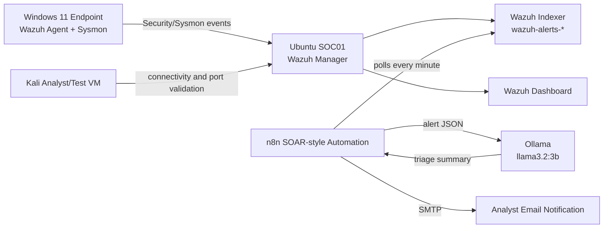

# AI-Assisted SOC Triage Pipeline

A portfolio SOC automation lab that connects Windows endpoint telemetry to Wazuh detections, n8n automation, local Ollama AI triage, and analyst email notification.

> **Project status:** Complete v1 lab. This is a private lab / learning environment, not a production deployment.

## Executive Summary

This project demonstrates a mini SOC pipeline:

```text
Windows 11 Endpoint
  -> Wazuh Agent + Sysmon + Windows Security Logs
  -> Ubuntu SOC01 running Wazuh Manager / Indexer / Dashboard
  -> n8n automation workflow
  -> Ollama local LLM triage summary
  -> Email notification to analyst
```

The workflow detects a Windows failed logon, queries the Wazuh Indexer for matching alerts, deduplicates alert IDs, sends alert context to a local LLM, and emails an AI-assisted triage summary.

## Architecture



## Lab Topology

| System | Role | Lab IP |
|---|---|---:|
| Ubuntu SOC01 | Wazuh + n8n + Ollama | `192.168.56.103` |
| Windows 11 | Monitored endpoint | `192.168.56.104` |
| Kali Linux | Analyst/test VM | `192.168.56.102` |

All three VMs use the `192.168.56.0/24` isolated lab network. See the [networking guide](docs/NETWORKING.md) for connectivity tests, expected ports, and exposure boundaries.

Private RFC1918 addresses are intentionally left visible because they document the lab topology and are not public internet addresses. Some imported evidence screenshots may show earlier DHCP addresses; the table above is the canonical address plan.

## What This Lab Proves

- Wazuh all-in-one deployment on Ubuntu SOC server.
- Windows Wazuh Agent enrollment and active endpoint monitoring.
- Sysmon telemetry collection from Windows.
- Detection proof for:
  - PowerShell process activity.
  - Failed logon attempts, Windows Event ID `4625`.
  - Local user and Administrators group changes, Event IDs `4720`, `4732`, `4726`.
- n8n automation pulling live Wazuh data from:
  - Wazuh Server API on port `55000` for agent status.
  - Wazuh Indexer/OpenSearch on port `9200` for alert data.
- Local AI summarization using Ollama and `llama3.2:3b`.
- Automated email notification from n8n after alert enrichment.

## Final Automated Workflow

```text
Schedule Trigger
  -> Query Wazuh Failed Logons
  -> Deduplicate New Alerts
  -> Ollama Summarize Alert
  -> Send an Email
```

The workflow is scheduled/near-real-time rather than webhook push-based. In this lab, n8n polls the Wazuh Indexer every minute.

## Key Screenshots

| Area | Evidence |
|---|---|
| Network and host readiness | [`screenshots/01-network-connectivity-soc01-to-windows-kali.png`](screenshots/01-network-connectivity-soc01-to-windows-kali.png) |
| Wazuh services and ports | [`screenshots/05-wazuh-services-active.png`](screenshots/05-wazuh-services-active.png), [`screenshots/08-soc01-wazuh-listening-ports.png`](screenshots/08-soc01-wazuh-listening-ports.png) |
| Windows endpoint active | [`screenshots/10-wazuh-dashboard-agent-active.png`](screenshots/10-wazuh-dashboard-agent-active.png) |
| Sysmon telemetry | [`screenshots/11-windows-sysmon-service-and-events.png`](screenshots/11-windows-sysmon-service-and-events.png) |
| Failed logon detection | [`screenshots/18-wazuh-failed-logon-alerts.png`](screenshots/18-wazuh-failed-logon-alerts.png) |
| n8n + Ollama POC | [`screenshots/26-n8n-sample-alert-workflow.png`](screenshots/26-n8n-sample-alert-workflow.png), [`screenshots/27-ai-triage-output-sample-alert.png`](screenshots/27-ai-triage-output-sample-alert.png) |
| Live Wazuh API integration | [`screenshots/31-n8n-wazuh-api-to-ollama-workflow.png`](screenshots/31-n8n-wazuh-api-to-ollama-workflow.png) |
| Real alert AI summary | [`screenshots/35-ai-summary-real-wazuh-alert.png`](screenshots/35-ai-summary-real-wazuh-alert.png) |
| Email notification | [`screenshots/37-email-alert-received-redacted.png`](screenshots/37-email-alert-received-redacted.png) |
| Published automation | [`screenshots/38-n8n-wazuh-alert-ai-email-workflow-active.png`](screenshots/38-n8n-wazuh-alert-ai-email-workflow-active.png) |

See the full screenshot catalog in [`docs/SCREENSHOTS.md`](docs/SCREENSHOTS.md).

## Security Notes

This repository intentionally excludes secrets and live credentials:

- Wazuh passwords
- Gmail app passwords
- n8n encryption keys
- JWT tokens
- real `.env` files
- credential screens with unredacted personal information

Private lab IP addresses are shown. Personal email addresses and local identity artifacts were sanitized where they appeared.

## Limitations

- The email workflow uses scheduled polling, not a native Wazuh webhook.
- AI-generated MITRE mappings must be validated by an analyst. The model can suggest imperfect ATT&CK technique mappings.
- Ollama runs locally on CPU in this lab, which is privacy-friendly but slower than GPU/cloud inference.
- The Wazuh Indexer was kept localhost-only and bridged to the n8n Docker container through a lab-only proxy rather than exposed to the LAN.

## Documentation

- [`docs/ARCHITECTURE.md`](docs/ARCHITECTURE.md)
- [`docs/NETWORKING.md`](docs/NETWORKING.md)
- [`docs/DETECTIONS.md`](docs/DETECTIONS.md)
- [`docs/AUTOMATION.md`](docs/AUTOMATION.md)
- [`docs/SCREENSHOTS.md`](docs/SCREENSHOTS.md)
- [`docs/RESUME_SUMMARY.md`](docs/RESUME_SUMMARY.md)
- [`docs/FRIEND_BUILD_GUIDE.md`](docs/FRIEND_BUILD_GUIDE.md)

## Repository Layout

```text
.
├── artifacts/
│   ├── config/
│   ├── n8n/
│   └── wazuh/
├── diagrams/
├── docs/
├── screenshots/
└── README.md
```
